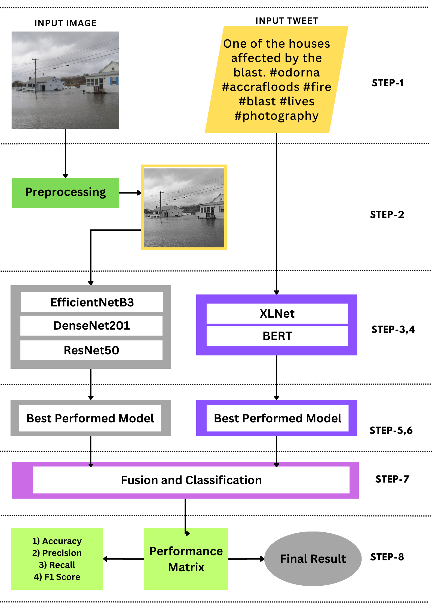

# Multimodal-Disaster-Event-Identification-from-Social-Media-Posts

The dataset used in this research, provided by Mouzannar et
al., plays a decisive role in the analysis and classification of image-tweet pairs related to disaster events. 
The dataset, which contains a total of 5831 image-tweet pairs, is divided
into two main subsets: a training set of 5247 samples and a test
set of 584 samples. This dataset is used to develop models that
can identify and classify different image-tweet pairs related to
disasters. 
The characteristic of the dataset is the imbalance of its
classes, which means that the distribution of samples between
different classes is not equal. The imbalance is clear when
looking at the number of samples in each category. The highest
number of samples is in the non-damage category, representing
cases where no damage was detected, with 2957 cases. In
contrast, the loss of life category, which refers to image-tweet
pairs that show damage resulting in casualties during disasters,
has the fewest samples, with only 240 cases. To facilitate the
classification task, the dataset contains five distinct pairs of
disaster images and tweets in addition to the Non-damage
(ND) category 

METHODOLOGY:  
  

This section presents the proposed methodology of
multimodal architecture for classifying disasters from social
media posts such as Images and tweets. Our model has two
parts that work side by side, the first dedicated to capturing
visual attributes, and the second focused on extracting textual
characteristics. We will now provide a breakdown of each
individual step within this architectural framework,  

Step-1) Input Image and Tweet: First of all, we split
the dataset with 80% for training, 10% testing, and 10% for
validation. In this step, the disaster Images and texts from the
training dataset are presented to the proposed model batch by
batch. For our work batch size is 12. 

Step-2) Image Preprocessing: First, we ensure that all images
Fig. 1. This methodology for disaster identification: The textual feature
extractor module is represented by the right side blocks, while the visual
feature extractor module is represented by the left side blocks
are the same size and to enable more effective processing,
we pre-processed each image by scaling it to 228*228*3.
Normalization technique is used to reduce the image pixels
will be scaled between 0 and 1. In this normalization process,
the image pixel values are normalized using mean and standard
deviation values of [0.485, 0.456, 0.406] and [0.229, 0.224,
0.225], respectively. This standardizes the pixel values to have
a mean of 0 and a standard deviation of 1, assisting in the
stabilization of the training process. Also, we use different
types of augmentation techniques such as 

a) Random Horizontal Flip: Images may be flipped horizontally at random. This is done at random to show the model
diverse perspectives on items. It’s analogous to showing the
computer how things may seem from the opposite side. This
improves the computer’s learning since it sees more ways that
objects might appear. 

b) Color Jitter: Color jitter is the controlled change of picture
color attributes like brightness, contrast, saturation, and hue. It
is like adjusting the colors a bit in the photos. This helps the
computer understand how things can still be the same, even
if the lighting changes. So, when the model sees pictures in
different lighting conditions, it’s not confused. 

c) Random Rotation: Using random rotations causes variety
in the orientation of the pictures. This is especially beneficial
when images in the collection have varying orientations. 

Step-3) Visual Feature Extractor: To extract the visual feature from the image, we used the transfer learning method.
First of all, we employed the pre-trained ResNet50 [16] model.
It is a pre-train CNN model. Its major goal is to solve the
vanishing gradient issue that occurs in extremely deep neural
networks. Gradients tend to get lower during backpropagation
as a CNN’s depth rises, making it more difficult for the
model to learn and update the weights correctly and resulting
in poor performance. By including ”skip connections” or
”shortcut connections,” which enable the network to learn
residual mappings, ResNet-50 addresses this issue. ResNet-50
has 50 layers and has shown outstanding results in a variety
of computer vision applications such as classifying the image,
detecting objects, and segmentation of images.  
Using a pre-trained DenseNet-201 model substantially
reduces the number of parameters, which means that we can
save time and resources, and benefit from the learned features
of the large dataset. It is also a pre-train CNN model with
consist of 201 layers. The main concept of DenseNet21 is to
feed-forward connect each layer to every other layer within
a single dense block. Information from all previous layers
can now flow straight into the current layer, improving feature propagation. It alleviates the vanishing-gradient problem,
which means that the network can learn from both shallow and
deep layers without losing information. This feature enables
DenseNet models to achieve state-of-the-art performance on
different computer vision tasks while being more parameter-efficient and simpler to train. It is used for classifying the
image, detecting objects, and segmentation of images.  
Lastly, EfficientNetB3 [17] models are designed to achieve
state-of-the-art accuracy on image classification tasks while
being smaller and faster than other models. It is also a
convolutional neural network construction and scaling method.
To equally modify the depth, breadth, and resolution dimensions, it uses a compound coefficient. Its increased depth,
width, and resolution enable it to capture more complex
patterns and features, leading to improved performance on
challenging visual recognition tasks. When a strong, precise,
and computationally efficient deep learning model is required
for computer vision applications, especially where resources
may be scarce and real-time or low-latency performance is
crucial, EfficientNetB3 is used. 

Step-4) Textual Feature Extractor: BERT and XLNet are
used to extract the feature from the Tweets.
BERT [19] converts words into numbers. BERT means Bidirectional Encoder Representations from Transformers. It is a
powerful natural language processing (NLP) model. It uses
transformer-based architecture which operates a Bi-directional
approach to process and understand the context of words in a
sentence whereas traditional NLP models process words in a
unidirectional manner. It involves pre-training on a substantial
corpus to learn contextual representations, followed by fine-tuning particular NLP tasks to complete tasks and generate
predictions. In our work So, use a pre-train ’bert-base-uncased’
model This allows the training of machine learning models on
textual data [37]. The limitations of BERT are solved by the
generalized autoregressive pretraining technique XLNet,
which maximized the predicted probability over all permutations of the factorization order. It builds on the Transformer XL architecture and follows a Bi-directional approach. It uses
permutation sampling to generate potential permutations of
the input tokens and maintains an autoregressive property
throughout pre-training, modeling the probability distribution
of a sequence by taking each token into account one at a time.
This makes it possible for XLNet to efficiently capture token
dependencies. 

Step-5) Choosing Best-performed CNN model: We compile
a list of models to run for our visual tasks. Then, we execute
all of the visual models with the identical hyperparameter
configuration and save the training and validation event history.
The accuracy and loss value of each epoch is stored in the
history. Then, from the accuracy list, we pick the index with
the highest value; if the index value is ’0,’ the ResNet-50
model is chosen; otherwise, the DenseNet201 model is chosen.
The hyperparameter values were- batch size = 12, iterations=
30000, learning rate = 1e-4 and epoch= 77, the epoch is
calculated by this formula- iterations
len(train dataset)
batch size We also use early stop criteria in the time of training to avoid
overfit. So, from all visual models, EfficientNetB3 performs
better than others. 

Step-6) Selecting Best Performed Language Model: The individual best-performing model is chosen from the previous
step which is exactly the same procedure that is applied for
selecting the visual model. In this step, Bert is selected and
sent to the next step named Fusion and Classification. 

Step-7) Fusion and Classification: The results from the dense
layer in both the visual and text parts are combined to create
a shared way of representing both visual and text aspects. By
concatenating visual and textual elements, we use a late fusion
technique [38] to achieve deep-level representation. In late
fusion, the input from several modalities is initially analyzed
independently, and the outputs or features obtained from these
modalities are afterward joined to get to a final prediction.
In the final classification layer of both modalities, the same
amount of hidden nodes is employed. We employ a similar
size, consisting of 512 nodes, to provide a fair contribution
from the text and visual parts. 

Step-8) Evaluate The Final Model: Accuracy, Precision
(P), recall (R), and weighted F1-score are used to compare
performance. The model’s misclassification rate has been
utilized as one of the metrics to effectively compare its
performance across several classes. To evaluate how well the
model performs, we utilize the weighted F1-score measure
